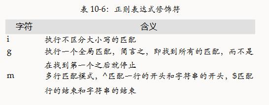

# 10.1 正则表达式的定义
- ECMAScript 3规范规定，一个正则表达式直接量会在执行到它时转换为一个RegExp对象，同一段代码所表示正则表达式直接量的每次运算都返回同一个对象。ECMAScript 5规范则做了相反的规定，同一段代码所表示的正则表达式直接量的每次运算都返回新对象。
- 如果不记得哪些标点符号需要反斜线转义，可以在每个标点符号前都加上反斜线。另外需要注意，许多字母和数字在有反斜线做前缀时也有特殊含义，所以对于想按照直接量进行匹配的字母和数字，尽量不要用反斜线对其转义。

# 10.1.2 字符类
- 有些字符类转义字符只能匹配ASCII字符，还没有扩展到可以处理Unicode字符，但可以通过十六进制表示方法来显式定义Unicode字符类，例如，/[\u0400-\u04FF]/用以匹配所有的Cyrillic字符）。
- \w 任何ASCII字符组成的单词，等价于[a-zA-Z0-9]
- \d 任何ASCII数字，等价于[0-9]

# 10.1.3 重复
- 上表中列出的匹配重复字符是尽可能多地匹配，而且允许后续的正则表达式继续匹配。因此，我们称之为“贪婪的”匹配。我们同样可以使用正则表达式进行非贪婪匹配。只须在待匹配的字符后跟随一个问号即可：“??”、“+?”、“*?”或“{1,5}?”。比如，正则表达式/a+/可以匹配一个或多个连续的字母a。当使用“aaa”作为匹配字符串时，正则表达式会匹配它的三个字符。但是/a+?/也可以匹配一个或多个连续字母a，但它是尽可能少地匹配。我们同样将“aaa”作为匹配字符串，但后一个模式只能匹配第一个a。

# 10.1.4 选择、分组、引用
- 字符“|”用于分隔供选择的字符
- 选择项的尝试匹配次序是从左到右，直到发现了匹配项。如果左边的选择项匹配，就忽略右边的匹配项，即使它产生更好的匹配。
- 正则表达式中的圆括号有多种作用。一个作用是把单独的项组合成子表达式，以便可以像处理一个独立的单元那样用“|”、“*”、“+”或者“?”等来对单元内的项进行处理
- 另一个作用是在完整的模式中定义子模式。
- 在正则表达式中不用创建带数字编码的引用，也可以对子表达式进行分组。它不是以“(”和“)”进行分组，而是以“(?:”和“)”来进行分组，

# 10.1.5 指定匹配位置
- 元素\B将把匹配的锚点定位在不是单词的边界之处。因此，正则表达式/\B[Ss]cript/与“JavaScript”和“postscript”匹配，但不与“script”和“Scripting”匹配。
- 表 10-5: 正则表达式中的锚字符

| 字符  | 含义                                                                                                                             |
| ----- | ------------------------------------------------------------------------------------------------------------------------------- |
| ^     | 匹配字符串的开头、在多行检索中，匹配一行的开头                                                                                       |
| $     | 匹配字符串的结尾，在多行检索中，匹配一行的结尾                                                                                       |
| \b    | 匹配一个单词的边界，简言之，就是位于字符\w和\W之间的位置，或位于字符\w和字符串的开头或者结尾之间的位置（但需要注意，[\b]匹配的是退格符）    |
| \B    | 匹配非单词边界的位置                                                                                                              |
| (?=p) | 零宽正向先行断言，要求接下来的字符都与p匹配，但不能包括匹配p的那些字符                                                                |
| (?!p) | 零宽负向先行断言，要求接下来的字符不与p匹配                                                                                         |

- JavaScript支持三个修饰符，修饰符“i”用以说明模式匹配是不区分大小写的。修饰符“g”说明模式匹配应该是全局的，也就是说，应该找出被检索字符串中所有的匹配。修饰符“m”用以在多行模式中执行匹配，在这种模式下，如果待检索的字符串包含多行，那么^和$锚字符除了匹配整个字符串的开始和结尾之外，还能匹配每行的开始和结尾。比如正则表达式/java$/im可以匹配“java”也可以匹配“Java\nis fun”。

  