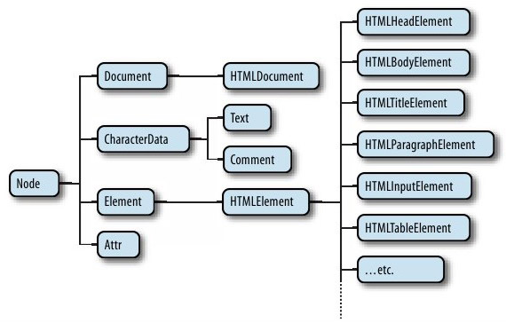

# 15.1 DOM 概览
- 树形的根部是Document节点，它代表整个文档。代表HTML元素的节点是Element节点，代表文本的节点是Text节点。Document、Element和Text是Node的子类
- 图15-2：文档节点的部分层次结构

  

# 15.2 选取文档元素
- 如果文档源代码未显式地包含<head>和<body>元素，浏览器将隐式地创建它们。
- 节点列表和HTML集合：getElementsByName()和getElementsByTagName()都返回NodeList对象，而类似document.images和document.forms的属性为HTMLCollection对象。

# 15.5 元素的内容
## 15.5.1 作为 HTML 的元素内容
- Web浏览器很擅长解析HTML，通常设置innerHTML效率非常高，甚至在指定的值需要解析时效率也是相当不错。但注意，对innerHTML属性用“+=”操作符重复追加一小段文本通常效率低下，因为它既要序列化又要解析。